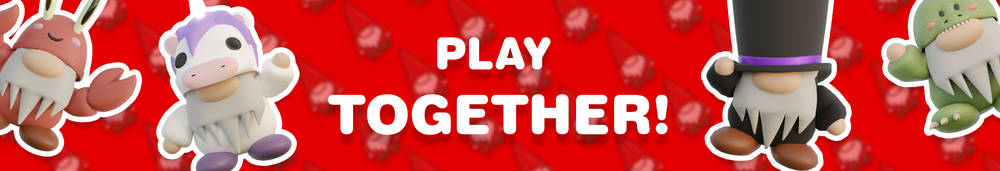
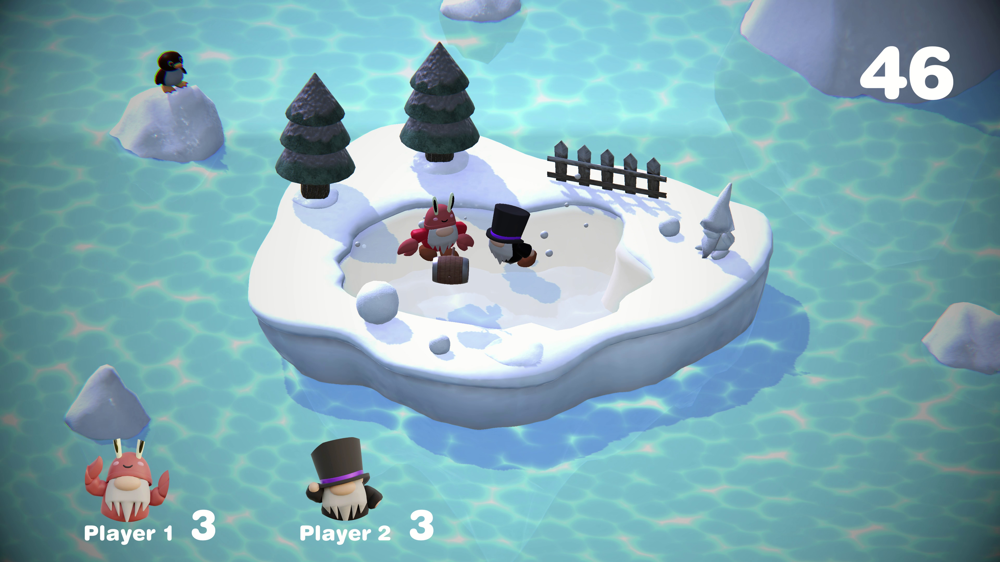
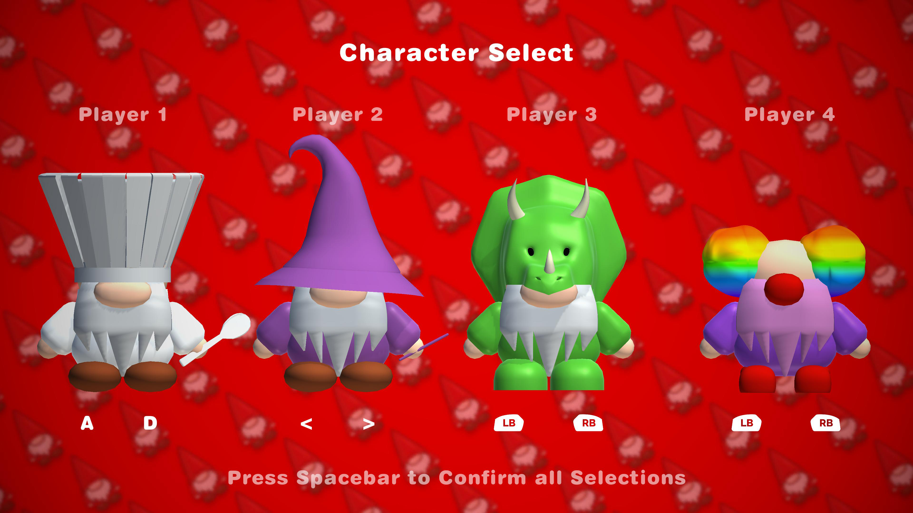
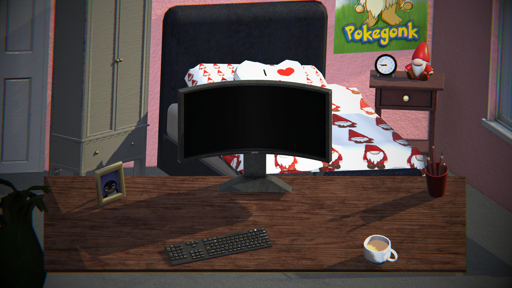
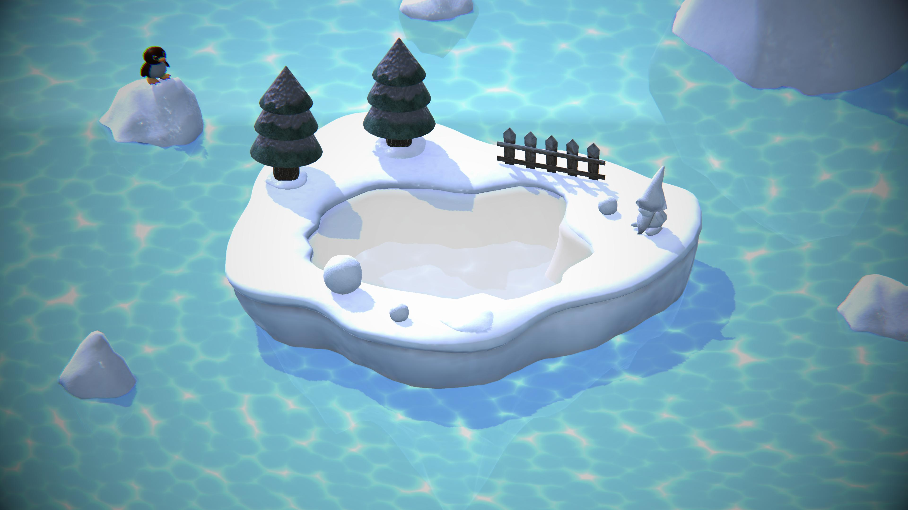
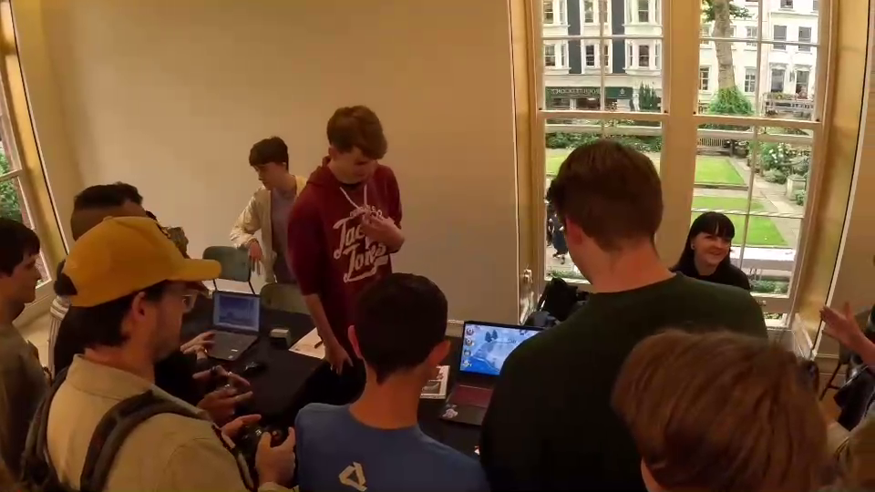
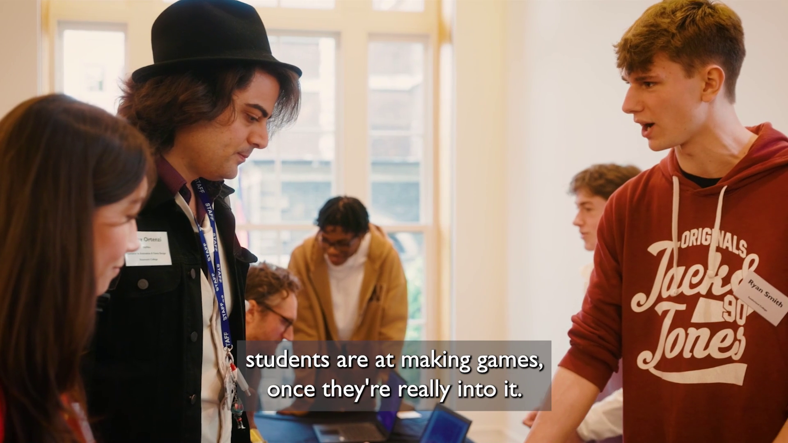

# Gonk

### About

Gonk supports a party of four local players. Your objective is to knock the other player/s off the stage's platform in order to win while looking good doing it with a selection of 10 playable gonks.

 

 

## Additional Information
During my level 3 experience, I developed Gonk within Unity 2020.3.16f1 utilising the `Dynamic Bone package made by Will Hong` and `XboxCtrlrInput made by JISyed` (for managing four controllers) until I migrated to `Guavaman Enterprises' Rewired` due to the compatibility with WebGL. Additionally the `Xbox button icons were made by Zacksly`.

Gonk is one of my largest projects as before it was showcased at **NextGen Skills Academy's 2023 Graduate Showcase at BAFTA Headquarters** it was initially revealed at Sunderland College's Graduate Showcase, after a great amount of playtesting and feedback sessions. Throughout these displays, approximately ***7 additional groups of four friends revelled in the gameplay together***.

 

## Credits
The 3D models produced by **Casey McBrearty** and **Bethany Harrop** were based upon the character and environmental concept art created by **Cade Charlton**. I developed the gameplay, UI, character select, and scenes. 

## Controls
The first two players must use keyboard whereas the optional players three and four must use controllers.

**Player One Controls:** WASD for Moving, Spacebar for Jumping, and E for Attacking.

**Player Two Controls:** Arrow Keys for Moving, CTRL for Jumping, and SHIFT for Attacking.

**Player Three & Four Controls:** Left Analog Stick for Moving, South Button for Jumping, and West Button for Attacking.
